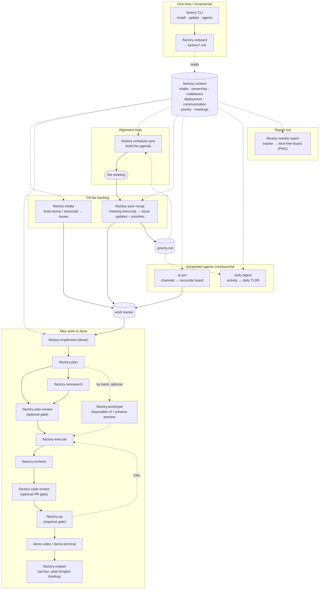

# Factory — a backlog intake & execution system for Claude Code

Factory is a suite of [Claude Code](https://claude.com/claude-code) skills that turn an unstructured brain-dump (or a meeting transcript) into a groomed, prioritized backlog in your real tracker — and then pick tasks back up and drive them to *ready-for-review*, autonomously.

It's two halves:

- **Intake** — talk through everything you have to do; Factory parses it into well-formed issues, classifies each, dedupes against what already exists, and files them in your tracker (GitHub / GitLab / Jira / …).
- **Execute** — point Factory at one issue; it sets up an isolated git worktree and runs a disciplined pipeline (diagnose → plan → re-research → implement → recheck → code review → **QA it like a real user** → demo → handoff), keeping the issue updated the whole way.

Every project is different, so the rules aren't hard-coded. Each repo gets a `factory/` directory describing how *that* project tracks work, runs its stack, communicates, and hands off. One skill — `factory-onboard` — sets that directory up and back-fills it as new capabilities need new context. Factory reads it; if something's missing, it onboards it with you first.

## How it fits together



## Install

### As a Claude Code plugin (recommended)

Factory ships as a plugin with its own marketplace, so installing and updating it are two commands inside Claude Code:

```
/plugin marketplace add MasonGeloso/factory
/plugin install factory@factory
```

Or from a terminal:

```bash
claude plugin marketplace add MasonGeloso/factory
claude plugin install factory@factory
```

Claude Code loads the skills straight from the plugin — nothing is copied into `~/.claude/skills`. Update with `/plugin update factory`, remove with `/plugin uninstall factory`.

Skills installed by a plugin are namespaced: `/factory:factory-intake`, `/factory:factory-implement`, and so on. (Typing the bare name still resolves — the namespaced form is what shows up in the skill list.)

The scheduled agents need the **Factory CLI**, which lives inside the plugin. `/factory-cli` runs it for you, or link it onto your PATH once:

```
/factory-cli install       # symlinks ~/.local/bin/factory → the plugin's bin/factory
```

After that, `factory agents install ai-pm /path/to/repo` works from any terminal. In plugin mode `factory install` installs the CLI and copies skills for Codex; Claude Code loads skills from the plugin. `factory update` defers source updates to `/plugin update` and refreshes Codex copies from the current plugin. Use `--target claude` to manage only the Claude Code installation.

### From a git checkout

```bash
git clone https://github.com/MasonGeloso/factory.git
cd factory
./install.sh
```

This copies the skills into both `~/.claude/skills/` and `${CODEX_HOME:-~/.codex}/skills/`. Existing changed skills are backed up under `${FACTORY_HOME:-~/.claude/factory}/skill-backups/<client>/`; unchanged skills are skipped. Override destinations with `CLAUDE_SKILLS_DIR` or `CODEX_SKILLS_DIR`. Skill names are un-namespaced this way: `/factory-intake`.

Use `./install.sh --target codex` (or `--target claude`) to install for one client only. The same `--target` option works with `factory install`, `factory update`, and `factory status`. Codex skills will be available on your next turn.

For Claude Code, choose either the plugin or copied skills to avoid duplicates. If you use the Claude Code plugin, run `./install.sh --target codex` from a checkout to install only the Codex copies.

`install.sh` is a thin wrapper around the **Factory CLI** (`bin/factory`, Python 3, zero dependencies). `factory install` also symlinks the CLI itself onto your PATH (`~/.local/bin/factory` by default — override with `FACTORY_BIN_DIR`), so after the first install you can run `factory` from anywhere:

```bash
factory install     # copy skills for Claude Code + Codex and link the CLI onto PATH
factory update      # git pull the checkout, then re-install only changed skills
factory status      # what's installed, and what has updates available
factory agents      # install / update / remove cron-style agents
factory             # no args → full-screen TUI (arrow-key nav) for all of the above
```

One-liner:

```bash
git clone https://github.com/MasonGeloso/factory.git /tmp/factory && /tmp/factory/install.sh
```

## Quick start

In any repo:

1. `/factory-intake` — first run onboards a `factory/` directory (tracker, CLI, classification, ownership, handoff). After that, paste a transcript and it files the issues.
2. `/goal /factory-execute <issue>` — first run onboards `codebases.md` + `deployment.md` (repos, worktrees, how to run the stack, demo mode). After that, it builds the task end to end.
3. `/factory-explain` — when it hands you a PR and you have no idea what it just did: a jargon-free briefing on what changed, what it decided on its own, what it skipped, and where the video and screenshots are.

## The skills

| Skill | Role |
|-------|------|
| `factory-onboard` | One-stop, partial-aware setup of the repo's `factory/` directory; back-fills missing context files |
| `factory-intake` | Brain-dump / transcript → classified, deduped issues in the tracker |
| `factory-execute` | Orchestrator: pick up one issue, run the pipeline, hand off |
| `factory-plan` | Diagnose (docs → logs → reproduce → validate) then write a plan |
| `factory-reresearch` | Attack the plan, find holes, fix them in place |
| `factory-implement` | Granular todo list, build, verify — don't stop until done |
| `factory-recheck` | Fresh-eyes review → PASS/FAIL verdict |
| `factory-plan-review` | Optional second-opinion review of the *plan*, before any code is written; blocking pre-Execute gate |
| `factory-prototype` | Optional, hand-invoked: build a disposable, full-effort preview of a task's end state — a real animated UI on a throwaway branch, or a schema/DAG diagram for backend-shaped work — before committing to the real implementation |
| `factory-frontend` | Design-system-grade UI standard (aesthetic direction, wireframing, hi-fi prototyping, accessibility/interaction/hierarchy audits, pre-ship polish pass) — invoked by `factory-implement`/`factory-execute` and `factory-prototype` for any task with a real UI surface |
| `factory-code-review` | Optional second-opinion review of the opened PR — runnable by an external CLI agent (e.g. Codex) or in-context; blocking gate right after the PR opens |
| `factory-qa` | **Required** gate: actually use the feature on the running stack — real user scenarios, desktop + mobile, paper-cuts and polish, real prompts/output over 3–5 examples — then post a QA report with screenshots and get an external second opinion |
| `factory-remember` | Turn a correction that just happened into a concise rule in the right gate's checklist (plan review / code review / QA) |
| `factory-weekly-rule-audit` | Review weekly agent failures and propose concise rule additions, edits, merges or removals in Markdown |
| `factory-demo-video` | Record a browser screencast of the change (web UI) — video **plus** captioned screenshots of each key state, desktop and mobile |
| `factory-demo-terminal` | Record a terminal screencast (CLI / stdout) — video **plus** a still of every scene |
| `factory-explain` | Ad-hoc, read-only briefing on a finished run, in plain English: what changed (before → now), which decisions were made without asking you, what was skipped or is still owed, what new work turned up, and clickable paths to the demo video and screenshots |
| `factory-terminal-demo-video` | Narrated, subtitled video of a **real interactive** CLI/agent session, replayed inside a CSS "OS" window |
| `factory-schedule-sync` | Build a high-leverage sync agenda from the backlog + attendees + priorities |
| `factory-sync-recap` | Meeting transcript → issue updates, decisions, and a refreshed `priority.md` |
| `factory-weekly-report` | Weekly tech-tree board as a shareable image: what shipped, what's in flight, what's blocked behind what |
| `factory-ai-pm` | Scheduled AI Product Manager: read the org's channels, reconcile the tracker |
| `factory-daily-digest` | Scheduled daily TLDR of activity across the org's systems |
| `factory-communication-setup` | Reference question-set for `communication.md` (used by `factory-onboard`) |

`factory-execute` invokes the others by name. `factory-onboard` sets up the `factory/` context all of them read.

## Agents (cron-style)

Beyond the on-demand skills, Factory can install **agents** that run on a schedule — a trivial `claude -p "…" --dangerously-skip-permissions` command wired to your OS scheduler (crontab on Linux, launchd on macOS). The scheduled command is identical on every machine; all the per-org behavior comes from the target repo's `factory/` directory.

Three agents ship today:

- **AI Product Manager** (`ai-pm`) — every few minutes, reads the org's communication channels since it last checked, then reconciles the work tracker against the conversation (opening, closing, assigning, commenting).
- **Daily Activity Digest** (`daily-digest`) — once a day, surveys recent activity across the org's systems (commits, issues, conversation) and posts a concise TLDR of what's being worked on, factoring in `priority.md` and flagging it when it's stale.
- **Weekly Tech-Tree Report** (`weekly-report`) — curates the tracker into a tech-tree investment board (what shipped, what's in flight, what's blocked behind what), renders it to a PNG, and posts the image. The board covers a rolling 7-day window; it posts each morning by default, or once a week with `--interval 10080`.

Where each scheduled post goes is per-org config: the **Scheduled posts** table in `factory/communication.md` names the channel, format, and upload call. No destination means the agent builds its artifact and posts nothing — it never guesses a channel.

Agent definitions live in `factory-agents/` in this repo (one directory per agent: `agent.json` + `prompt.md`). Not `agents/` — Claude Code reads a plugin's `agents/` directory as subagent definitions, and these are cron jobs, not subagents.

```bash
factory agents list                          # available + installed, with update flags
factory agents install ai-pm /path/to/repo   # per-repo; onboards missing context first
factory agents install daily-digest /path/to/repo --interval 1440   # once a day
factory agents update  ai-pm /path/to/repo   # re-render if the agent's prompt/skill changed
factory agents remove  ai-pm /path/to/repo   # unschedule + clean up
```

Intervals accept sub-hour (`--interval 5`), hourly (`--interval 120`), or daily (`--interval 1440`) cadences.

Agents are **per-repo**: the target repo must already have a `factory/` directory (run `/factory-intake` once). If the agent needs config that isn't there yet — the AI PM needs `factory/communication.md` — install launches an interactive Claude Code session running the matching setup skill (`factory-communication-setup`), then schedules the agent once the file exists. Installed agents, their wrappers, logs, and last-read state live under `~/.claude/factory/`.

## The classification system

Each item gets a **T** (priority) and an **E** (complexity / autonomy) — independent axes. **T does not imply size.**

- **T1 / T2 / T3** — must-ship-now / imminent-and-important / amorphous-or-later (framed against a product launch).
- **E1 / E2 / E3** — hands-on & spec-heavy / semi-autonomous / fully hands-off & likely auto-mergeable.

A project can opt out and use a simpler scheme; its `factory/intake.md` declares the mapping onto real labels/fields. `factory-execute` uses the E-level to set how autonomous the run is (E3 never asks; E1 is expected to ask design questions) and how many re-research rounds it does.

## Requirements

- Claude Code.
- Your tracker's CLI (`gh`, `glab`, `jira`, …) — whatever your `factory/intake.md` declares.
- For demos: `factory-demo-video` drives a browser via the `playwright-cli` skill; `factory-demo-terminal` needs Python `playwright` (`pip install playwright && playwright install chromium`) + `ffmpeg`.
- `factory-terminal-demo-video` additionally needs `pexpect` and, if you want narration, a TTS provider; it ships no icon set (licence decision — see its `chrome/README.md`).

## License

MIT — see [LICENSE](LICENSE).

### Reliable external reviews

Plan/code/QA reviewers share a [run helper and recovery guide](skills/factory-code-review/references/review-runs.md).
It isolates each review's output, records its revision and process, and rejects incomplete or stale
verdicts. Project `factory/code-review.md` invocations can wrap their existing CLI with this helper;
update installed skills before referencing it. Existing reviewer/model choices stay in project config.
Factory runs also keep a short local record (`git rev-parse --git-path factory-run.md`) so resumption can recover requirements,
review handles and evidence without guessing from a previous summary.

Maintainer checks: `python3 -m unittest discover -s tests -v` exercises the helper with real child
processes and disposable Git repositories, without a paid reviewer or external posting.
